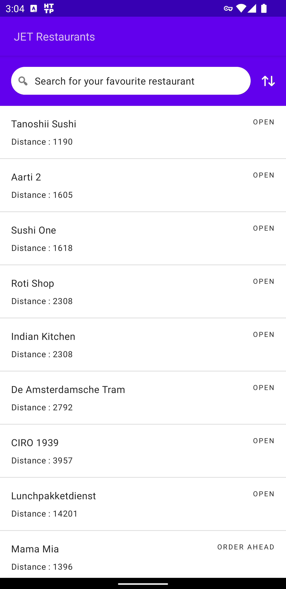

# JET Restaurants

This project is done as [Assignment]() for Senior Android Engineer position at JET.

## Authors

- [Mashhood Qazi](https://github.com/mashhoodqazi93)

## Screenshots

 

## Feature and Functionality
Following are the basic functionalities that were required and have been implemented
| Requested Functionality  | Status |
| ------------- | ------------- |
| Read Restaurants List from JSON and display  | DONE  |
| Search Restaurants based on `name`  | DONE  |
| Always Sort by Restaurant `status`  | DONE  |
| Add additional sorting functionallity based on other Parameters  | DONE  |
| Keep UI and Business Logic code sepatate  | DONE  |
| Maintain "Sorting Value" if app is killed in background by the OS **(BONUS)** | DONE  |
| Modularization | DONE  |
| Unit Testing  | DONE  |
| UI Testing **(BONUS)** | DONE  |
| Used Version Control and Readme | DONE  |

## Architecture
Overall, this project has been purely built using the guidelines provided by google.

The Architecture is based on the following points
- MVVM (Separation of UI from Business logic)
- Clean Architecture (Different layers for Data and Domain)

### Language and Major Libraries Used
- Kotlin 
- Compose (For UI. All UI is driven by State)
- Room (Database)
- Hilt (DI)

### Modularization
We have the following modules in this project
- App Module (the main default module)
- Core Module (Responsible for having data that might be useful for other modules)
- Feature-Restaurant Module (Responsible for the complete feature implementation)

In future if we want to add more features, then separate feature modules will be created for that.

## Strategy

### Reading Data from JSON File
A simple approach for reading data from the provided JSON file could have been, reading data directly from json file, store it in a variable and apply sorting logic at the end.
But this approach would have fallen apart once the size increases. So, it was not feasible and scalable.

### Implemented approach
Following is the approach that has been implemented for reading data from JSON file
- Include JSON file in assets folder
- Pre-populate the database at the time of creation
- Listen to live changes from database using Flow. This is required when the app starts for the first time and data is not yet loaded into the database. So as soon as database is populated, it is dispalyed on the UI.
#### Advantages
- Scalable
- Not reading JSON File again and again
- Sorting will be more stable and scalable through queries instead of manual logic functions

### Search & Sort
Writing manual logic functions was a possible approach. We could read data from data base and write manual search and sort functions quickly. But the fate would be the same, as the Database would grow, the maual functions would not be able to sustain that and slow down as compared to SQL queries.

### Implemented approach
Following is the approach that has been implemented for Seach and Sorting of the Restaurants List from Room database.
- Single Query written to support Seach as well as Sorting functionality.

#### Advantages
- Robust and Scalable
- No boiler plate code

## Testing

Unit Testing and UI Testing has been implemneted

### Unit Testing
Following Unit/Instrumentation Tests have been implemneted
- Data insertion in Database
- Sorting Test
- Searching Test

### UI Testing
Following UI Tests have been implemneted
- Sort Button Visibility Test
- Sort Bottom Dialog Visibility Test
- Sort Dialog Dismissal Test (on click of cross icon)

## Git Structure

This project has been properly committed and pushed on Git.
Following are some rules that were followed
- Multiple commits made in separate feature branches
- Porper commit messages added for every commit.
- Pull Requests used to merge the branches in Master branch
## Future Improvements
There are a few other items that could make this project look more complete.

- SpotLess (For ensuring code quality)
- Bitrise (For auto build generation using CI/CD pipelines)
